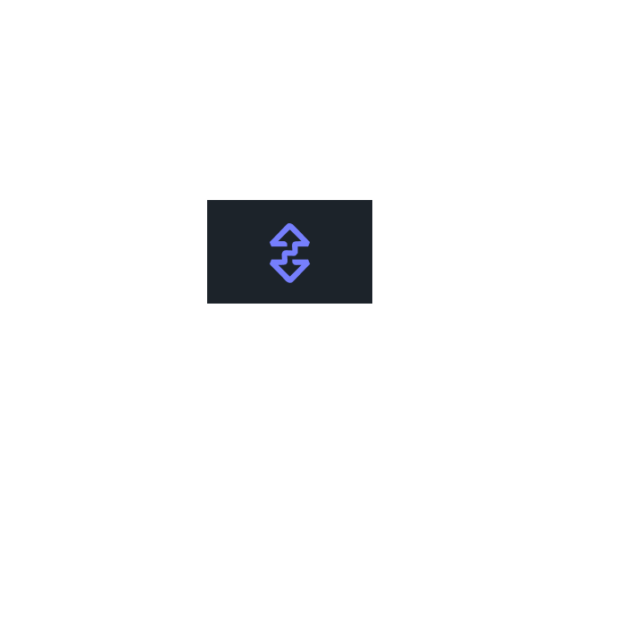

<!-- Improved compatibility of back to top link: See: https://github.com/othneildrew/Best-README-Template/pull/73 -->
<a id="readme-top"></a>
<!--
*** Thanks for checking out the Best-README-Template. If you have a suggestion
*** that would make this better, please fork the repo and create a pull request
*** or simply open an issue with the tag "enhancement".
*** Don't forget to give the project a star!
*** Thanks again! Now go create something AMAZING! :D
-->


<!-- PROJECT SHIELDS -->
<!--
*** I'm using markdown "reference style" links for readability.
*** Reference links are enclosed in brackets [ ] instead of parentheses ( ).
*** See the bottom of this document for the declaration of the reference variables
*** for contributors-url, forks-url, etc. This is an optional, concise syntax you may use.
*** https://www.markdownguide.org/basic-syntax/#reference-style-links
-->
[![Contributors][contributors-shield]][contributors-url]
[![Forks][forks-shield]][forks-url]
[![Stargazers][stars-shield]][stars-url]
[![Issues][issues-shield]][issues-url]
[![MIT License][license-shield]][license-url]
[![LinkedIn][linkedin-shield]][linkedin-url]


<!-- PROJECT LOGO -->
<br />
<div align="center">
  <a href="https://github.com/utkarshdagoat/FlipBridge">
    
  </a>

<h3 align="center">Flip Bridge </h3>

  <p align="center">
    
<b>Flip Bridge</b> elevates <b>Chainflip</b>'s utility by enabling seamless token swaps with Uniswap's ecosystem of over 700 tokens, enhancing liquidity and trading flexibility.project_description
    <br />
    <a href="https://github.com/utkarshdagoat/FlipBridge"><strong>Explore the docs »</strong></a>
    <br />
    <br />
    <a href="https://github.com/utkarshdagoat/FlipBridge">View Demo</a>
    ·
    <a href="https://github.com/utkarshdagoat/FlipBridge/issues/new?labels=bug&template=bug-report---.md">Report Bug</a>
    ·
    <a href="https://github.com/utkarshdagoat/FlipBridge/issues/new?labels=enhancement&template=feature-request---.md">Request Feature</a>
  </p>
</div>


<!-- TABLE OF CONTENTS -->
<details>
  <summary>Table of Contents</summary>
  <ol>
    <li>
      <a href="#about-the-project">About The Project</a>
      <ul>
        <li><a href="#built-with">Built With</a></li>
      </ul>
    </li>
    <li>
      <a href="#getting-started">Getting Started</a>
      <ul>
        <li><a href="#prerequisites">Prerequisites</a></li>
        <li><a href="#installation">Installation</a></li>
      </ul>
    </li>
    <li><a href="#usage">Usage</a></li>
    <li><a href="#roadmap">Roadmap</a></li>
    <li><a href="#contributing">Contributing</a></li>
    <li><a href="#license">License</a></li>
    <li><a href="#contact">Contact</a></li>
    <li><a href="#acknowledgments">Acknowledgments</a></li>
  </ol>
</details>


<!-- ABOUT THE PROJECT -->
## About The Project

[![Product Name Screen Shot][product-screenshot]](https://example.com)
Flip Bridge is a sophisticated DeFi project that enhances the utility of Chainflip by integrating it with Uniswap, leveraging Cross-Chain Messaging (CCM) to facilitate seamless token swaps across both platforms. This integration significantly expands Chainflip's use case, connecting it to Uniswap's vast ecosystem with over 700 tokens, thereby providing users with unparalleled liquidity and trading flexibility across multiple blockchain networks.

<p align="right">(<a href="#readme-top">back to top</a>)</p>

<p align="right">(<a href="#readme-top">back to top</a>)</p>

## Architecture
Here is the architecture and internal working for the Aggreagator contract

[![Architecture][architecure]](https://example.com)

### Aggregator Contract's cfRecieve
```javascript
 function cfReceive(
        uint32 srcChain,
        bytes calldata srcAddress,
        bytes calldata message,
        address token,
        uint256 amount
    ) external payable returns (uint256 amountOut) {
        require(msg.sender == address(cfVault), "only router");
        (bytes memory callData, address sender) = abi.decode(
            message,
            (bytes, address)
        );
        if (msg.value > 0) {
            wETH.deposit{value:msg.value}();
            wETH.approve(address(swapRouter), msg.value);
            (bool _success, ) = address(swapRouter).call(callData);
            if (!_success) {
                wETH.withdraw(msg.value);
                payable(sender).transfer(msg.value);
                emit UniswapErrorFundsReturned(ETH_ADDRESS, sender, msg.value);
            }
        } else {
            IERC20(token).approve(address(swapRouter), amount);
            (bool _success, ) = address(swapRouter).call(callData);
            if (!_success) {
                IERC20(token).transfer(sender, amount);
                emit UniswapErrorFundsReturned(token, sender, amount);
            }
        }

        emit UniswapCCM(srcChain, srcAddress, token, amount);
    }
```
The tests are written in `test/UniswapAggregator.t.sol`

### The contract is live on the mainnet here <a href="https://etherscan.io/address/0xa8c9718d3a790604311206d1748a1e17334eef8b">0xa8c9718d3a790604311206d1748a1e17334eef8b</a>

<!-- GETTING STARTED -->
## Getting Started

This is an example of how you may give instructions on setting up your project locally.
To get a local copy up and running follow these simple example steps.

### Prerequisites

This is an example of how to list things you need to use the software and how to install them.
*yarn 
  ```sh
  npm install yarn@latest -g
  ```

### Installation

1. Clone the repo
   ```sh
   git clone https://github.com/utkarshdagoat/FlipBridge.git
   ```
2. Install NPM packages
   ```sh
   yarn && yarn dev
   ```
3. Go to <a href="http://localhost:5173"> localhost </a>

<p align="right">(<a href="#readme-top">back to top</a>)</p>

### Running the foundry tests
Ensure you get the latest route data via the Uniswap Alpha router SDK.
```bash
cd flipBridge &&  forge test --fork-url <Your-Fork-url>  --match
-path test/UniswapAggregator.t.sol -vvv  --gas-report
```
<!-- USAGE EXAMPLES -->
## Usage

Use this space to show useful examples of how a project can be used. Additional screenshots, code examples and demos work well in this space. You may also link to more resources.

_For more examples, please refer to the [Documentation](https://example.com)_

<p align="right">(<a href="#readme-top">back to top</a>)</p>


<!-- ROADMAP -->
## Future Prospects for Flip Bridge

#### Expansion of Supported Tokens and Networks:
Integration with More DEXs: Extend support to other major decentralized exchanges (DEXs) like SushiSwap, PancakeSwap, and Balancer to provide users with a wider range of token swapping options and deeper liquidity pools.
#### Intergration With squid router!!

See the [open issues](https://github.com/utkarshdagoat/FlipBridge/issues) for a full list of proposed features (and known issues).

<p align="right">(<a href="#readme-top">back to top</a>)</p>


<!-- CONTRIBUTING -->
## Contributing

Contributions are what make the open source community such an amazing place to learn, inspire, and create. Any contributions you make are **greatly appreciated**.

If you have a suggestion that would make this better, please fork the repo and create a pull request. You can also simply open an issue with the tag "enhancement".
Don't forget to give the project a star! Thanks again!

1. Fork the Project
2. Create your Feature Branch (`git checkout -b feature/AmazingFeature`)
3. Commit your Changes (`git commit -m 'Add some AmazingFeature'`)
4. Push to the Branch (`git push origin feature/AmazingFeature`)
5. Open a Pull Request

<p align="right">(<a href="#readme-top">back to top</a>)</p>


<!-- LICENSE -->
## License

Distributed under the MIT License. See `LICENSE.txt` for more information.

<p align="right">(<a href="#readme-top">back to top</a>)</p>


<!-- CONTACT -->
## Contact

Utkarsh - utkarsh382004@gmail.com

Project Link: [https://github.com/utkarshdagoat/FlipBridge](https://github.com/utkarshdagoat/FlipBridge)

<p align="right">(<a href="#readme-top">back to top</a>)</p>


<p align="right">(<a href="#readme-top">back to top</a>)</p>


<!-- MARKDOWN LINKS & IMAGES -->
<!-- https://www.markdownguide.org/basic-syntax/#reference-style-links -->
[contributors-shield]: https://img.shields.io/github/contributors/utkarshdagoat/FlipBridge.svg?style=for-the-badge
[contributors-url]: https://github.com/utkarshdagoat/FlipBridge/graphs/contributors
[forks-shield]: https://img.shields.io/github/forks/utkarshdagoat/FlipBridge.svg?style=for-the-badge
[forks-url]: https://github.com/utkarshdagoat/FlipBridge/network/members
[stars-shield]: https://img.shields.io/github/stars/utkarshdagoat/FlipBridge.svg?style=for-the-badge
[stars-url]: https://github.com/utkarshdagoat/FlipBridge/stargazers
[issues-shield]: https://img.shields.io/github/issues/utkarshdagoat/FlipBridge.svg?style=for-the-badge
[issues-url]: https://github.com/utkarshdagoat/FlipBridge/issues
[license-shield]: https://img.shields.io/github/license/utkarshdagoat/FlipBridge.svg?style=for-the-badge
[license-url]: https://github.com/utkarshdagoat/FlipBridge/blob/master/LICENSE.txt
[linkedin-shield]: https://img.shields.io/badge/-LinkedIn-black.svg?style=for-the-badge&logo=linkedin&colorB=555
[linkedin-url]: https://linkedin.com/in/linkedin_username
[product-screenshot]: images/product.png
[Next.js]: https://img.shields.io/badge/next.js-000000?style=for-the-badge&logo=nextdotjs&logoColor=white
[Next-url]: https://nextjs.org/
[React.js]: https://img.shields.io/badge/React-20232A?style=for-the-badge&logo=react&logoColor=61DAFB
[React-url]: https://reactjs.org/
[Vue.js]: https://img.shields.io/badge/Vue.js-35495E?style=for-the-badge&logo=vuedotjs&logoColor=4FC08D
[Vue-url]: https://vuejs.org/
[Angular.io]: https://img.shields.io/badge/Angular-DD0031?style=for-the-badge&logo=angular&logoColor=white
[Angular-url]: https://angular.io/
[Svelte.dev]: https://img.shields.io/badge/Svelte-4A4A55?style=for-the-badge&logo=svelte&logoColor=FF3E00
[Svelte-url]: https://svelte.dev/
[Laravel.com]: https://img.shields.io/badge/Laravel-FF2D20?style=for-the-badge&logo=laravel&logoColor=white
[Laravel-url]: https://laravel.com
[Bootstrap.com]: https://img.shields.io/badge/Bootstrap-563D7C?style=for-the-badge&logo=bootstrap&logoColor=white
[Bootstrap-url]: https://getbootstrap.com
[JQuery.com]: https://img.shields.io/badge/jQuery-0769AD?style=for-the-badge&logo=jquery&logoColor=white
[JQuery-url]: https://jquery.com 
[architecure]: images/architecture.png